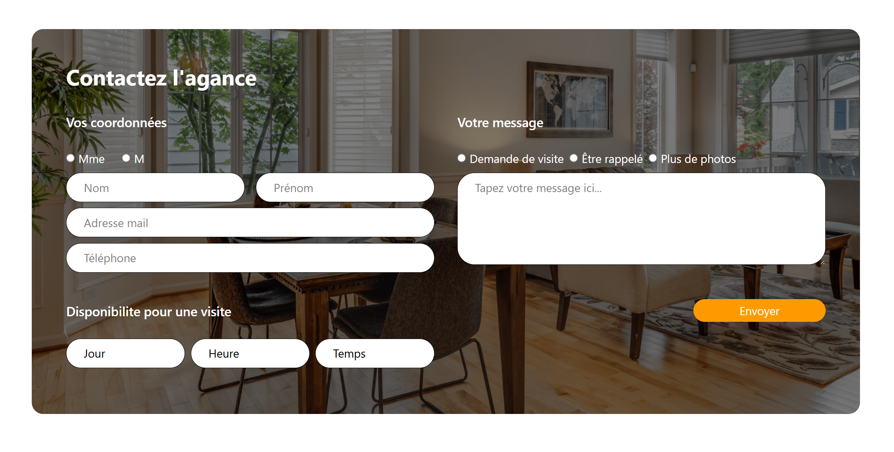

# Contact Form App

Une application **Next.js** connectée à une base de données **MongoDB Atlas**, permettant aux utilisateurs de soumettre un formulaire de contact.  
Le backend est géré via les routes API de Next.js, et les données sont persistées dans MongoDB.

---

## Technologies

- [Next.js](https://nextjs.org/) – Framework React
- [MongoDB Atlas](https://www.mongodb.com/cloud/atlas) – Base de données NoSQL dans le cloud
- [Docker](https://www.docker.com/) – Conteneurisation pour un déploiement simplifié

---

## Fonctionnalités

- Formulaire complet de contact :
  - Nom, prénom, email, téléphone
  - Genre (Mme, M)
  - Sujet (visite, rappel, photos)
  - Message personnalisé
  - Disponibilité (jour, heure, durée)
- Validation via Mongoose
- Gestion des erreurs serveur et client
- Sauvegarde des données dans MongoDB

---

## Configuration

Avant de lancer l’application, crée un fichier `.env` à la racine du projet avec une chaîne de connexion MongoDB :
```bash
 MONGODB_URI=url_to_mongodb_atlas
```
 ---

##  Lancer avec Docker

```bash
docker build . -t contactForm
docker run -p 3000:3000 contactForm
```

L'application sera accessible sur http://localhost:3000


## Screen



## Moi

Je m'appelle Elhadi Ezzeroug Ezzraimi, actuellement étudiant en Master 2 Génie Logiciel à l'Université de Montpellier.
Je suis à la recherche d’un stage de fin d’études d’une durée de 6 mois, à partir de maintenant, dans le domaine du développement web ou logiciel.

## Questions

1. Avez-vous trouvé l'exercice facile ou vous a-t-il posé des difficultés ? Si oui, lesquelles ?

Dans l’ensemble, j’ai trouvé l’exercice intéressant et plutôt accessible. Par contre, la complexité principale a été Docker, avec lequel je ne suis pas encore totalement à l’aise. En dehors de ça, je n’ai pas rencontré de réel problème.


2. Avez-vous appris de nouveaux outils pour répondre à l'exercice ? Si oui, lesquels ?

Oui, j’ai pu m’exercer à Docker pour containeriser une application fullstack, ce qui était nouveau pour moi. J’ai aussi approfondi la gestion du backend dans Next.js via ses API routes

3. Pourquoi avoir choisi d'utiliser ces outils ?

J’ai choisi Next.js parce que c’est un framework moderne qui facilite la création d’applications React fullstack avec peu de configuration. MongoDB Atlas est pratique pour une base cloud rapide à déployer, sans installation locale compliquée. Quant à Docker, c’est l’outil parfait pour simplifier le déploiement.

4. Avez-vous utilisé la stack proposée ?

Non, je n’ai pas utilisé la stack proposée. Je me suis concentré sur Next.js et MongoDB Atlas parce que je voulais livrer un projet propre, fonctionnel, et que je maîtrise bien ces outils. Ça m’a aussi permis d’aller plus vite et de bien respecter le délai.